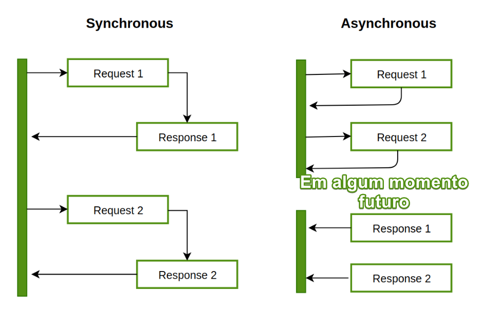
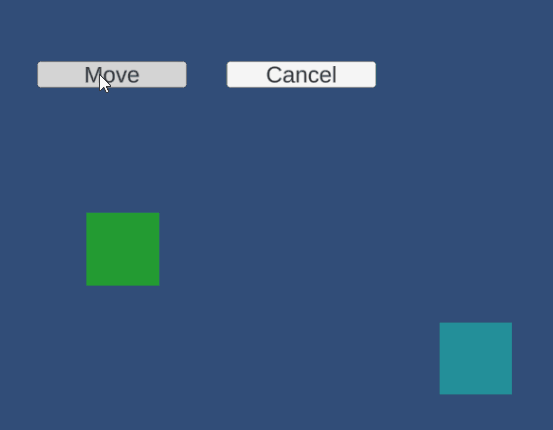

# Programação assíncrona na Unity

Programação assíncrona é um recurso muito utilizado quando o resultado de uma operação não está disponível ou não é necessário imediatamente quando executado. Essa operação é então colocada em espera pelo sistema e volta a ser executada quando o resultado estiver disponível. Isso permite ao sistema colocar outra operação para ser executada em seu lugar.

Esse tipo de recurso melhora a percepção do usuário em sua aplicação, já que enquanto o sistema está aguardando alguma resposta, pode continuar renderizando a tela por exemplo, assim o usuário não percebe que o sistema está travando.



A imagem acima demonstra algumas requisições assíncronas. A esquerda a imagem demonstra uma operação síncrona onde uma é executada depois da outra. No lado direito temos o exemplo de uma execução assíncrona, cada operação é feita e seus resultados são retornados em algum momento futuro, sem garantir sua ordem.

Durante o desenvolvimento de um jogo podemos nos deparar com vários exemplos de operações desse tipo. Temos por exemplo requisições feitas em servidores, onde o resultado depende da resposta do servidor e também do transporte do servidor pela rede até o jogo cliente, assim fazendo um requisição assíncrona podemos liberar o sistema para executar outras operações enquanto esperamos que essa resposta seja fornecida. O mesmo se aplica para sistemas de saving, inteligência artificial, animações entre vários outros possibilidades.

Vamos então a implementação de um exemplo utilizando programação assíncrona na Unity.

# Implementação na Unity

Para implementar programação assíncrona na Unity é muito simples. Vamos utilizar principalmente as palavras reservadas de `async/await`. O termo `async` define um método assíncrono e o `await` define que aquela operação terá o seu resultado em um momento futuro, e assim o programa pode suspender sua execução enquanto o resultado não está disponível.

Aqui vai um link de referência para a documentação de programação assíncrona em C#.

https://learn.microsoft.com/pt-br/dotnet/csharp/asynchronous-programming/async-scenarios

A demonstração quer iremos implementar para demonstrar esse conceito consistem em dois cubos na tela, quando o jogador pressionar o botão de Move os cubos irão se movimentar de forma que o segundo cubo irá se movimentar quando o primeiro terminar de se mover.

> 🐶 Pense comigo: Esse exemplo foi escolhido justamente porque em jogos muitas vezes precisamos aguardar resultados que demoram vários frames para ser executados, como nesse caso a movimentação.

Para a movimentação do cubo vamos criar um método que calcule sua movimentação. A movimentação do cube será feita de forma interpolada para deixar o movimento mais fluído. 

```csharp
public class CubeMovement : MonoBehaviour
{
  private CancellationTokenSource cancellationToken;

  public async Task MoveRandom()
  {
    var time = 2f;
    var x = 5f;
    var y = transform.position.y;

    var initialPos = transform.position;
    var endPos = new Vector3(x, y, 0);
    for(float t = 0; t < time; t += 0.01f)
    {
        transform.position = Vector3.Lerp(initialPos, endPos, t / time);
        await Task.Delay(10); // add a small delay to smooth the movement
    }
  }
}
```

Para utilizar esse movimento do cubo vamos criar um script com a referência do botão de movimentação e implementar seu comportamento.

```csharp
    public class AsyncProgrammingDemo : MonoBehaviour
    {
        [SerializeField] private CubeMovement firstCube;
        [SerializeField] private CubeMovement secondCube;

        [SerializeField] private Button moveButton;

        public void Start()
        {
            moveButton.onClick.AddListener(MoveCubes);
        }

        private async void MoveCubes(){
          await firstCube.MoveRandom();
          await secondCube.MoveRandom();
        }
    }
```

Para declarar um método assíncrono adicionamos a palavra `async` e então definimos quais operações precisamos aguardar até que estejam concluídas para avançar na execução com a palavra `await`.

Fazendo as devidas configurações na cena temos o seguinte resultado.


Como podemos observar na imagem o cubo verde começa seu movimento quando o jogador pressiona o botão `Move`, quando ele chega na posição final seu movimento é encerrado e então é iniciado o movimento do cubo ciano.

> 🐶 Pense comigo: em outras aplicações que desenvolvi, antes de utilizar programação assíncrona, era necessário ou eventos para avisar que certo objeto chegou a seu destino ou variáveis de controle. Com a abordagem assíncrona é muito mais simples de implementar e entender o que está acontecendo.

# Cancelamento de uma operação assíncrona

Uma outra funcionalidade de uma função assíncrona é a possibilidade de cancelá-la. Como o resultado ainda não está disponível podemos definir que depois de tanto tempo ou dada outra ação do sistema esse resultado não é mais necessário e então cancelar a operação.

Esse mecanismo de cancelamento é feito por meio do `CancellationToken`. Essa é uma estrutura que já está implementada para ser utilizada com chamadas assíncronas de provê várias funcionalidades como cancelamento por timeout, notificação de cancelamento, operação thread-safe.

Vamos adicionar então a funcionalidade de cancelar o movimento do cubo.

```csharp
public async Task MoveRandom(CancellationTokenSource cancellationToken = null){
  // ... código anterior

  // adicionamos dentro do loop
  if(cancellationToken != null && cancellationToken.IsCancellationRequested)
  {
      Debug.Log("Cube movement canceled!");
      return;
  }

  // ... código anterior
}
```

E então no nosso script de demonstração adicionamos a seguinte implementação

```csharp
public class AsyncProgrammingDemo : MonoBehaviour
{
  // ... código anterior

  [SerializeField] private Button cancelButton;
  private CancellationTokenSource cancellationToken;

  public void Start()
  {
      cancelButton.onClick.AddListener(() => {
          cancellationToken.Cancel();
      });
  }

  public async void MoveCubes()
  {
      cancellationToken = new CancellationTokenSource();
      await firstCube.MoveRandom(cancellationToken);
      await secondCube.MoveRandom(cancellationToken);
  }
}
```

Como podemos perceber a chamada de cancelamento não é uma chamada assíncrona, ela imediatamente dispara os eventos de cancelamento que estão registrados a esse token. Como resultado temos



Quando o jogador apenas o botão de cancelar o movimento é cancelado para todos os cubos, isso porque eles compartilham o mesmo token de cancelamento. Se tokens de cancelamento diferentes fossem criados poderíamos cancelar cada um de forma independente.

> 🐶 Pense comigo: Programação assíncrona vs Programação paralela

Um conceito que algumas pessoas podem fazer confusão é a diferença em programação assíncrona do conceito de paralelismo. Não necessariamente se uma operação está sendo feita de forma assíncrona ela está sendo executada de forma paralela.

No exemplo anterior se removermos as palavras `await` da frente da chamada do método MoveRandom de cada cubo, vamos ter o seguinte resultado. 


Por essa imagem temos a percepção que a movimentação dos objetos está sendo feita de forma paralela, porém isso é equivocado. Na real esses objetos estão sendo atualizados de forma sequencial na Thread principal da Unity. Podemos verificar isso facilmente imprimindo no console a thread que está sendo executada, e assim verificamos que é a mesma para os dois blocos.

# Biluca, o que tiramos disso tudo?

Nesse artigo exploramos o conceito de programação assíncrona e suas principais aplicações no desenvolvimento de games. Pelo que podemos ver é bem simples de começar a implementar na Unity. 

Pelo exemplo de movimentação dos cubos aprendemos a declarar funções assíncronas e ordenar suas execuções. Além disso também implementamos a funcionalidade de cancelar a execução dessas funções.

Agora que aprendemos mais sobre programação assíncrona temos mais um recurso poderoso em nossas mãos que além de melhorar a percepção do usuário também melhora bastante a legibilidade do código.

Até a próxima e tenha um bom dia 🐶.

# Referências

- [Guia do C# - Programação assíncrona](https://learn.microsoft.com/pt-br/dotnet/csharp/asynchronous-programming/async-scenarios)