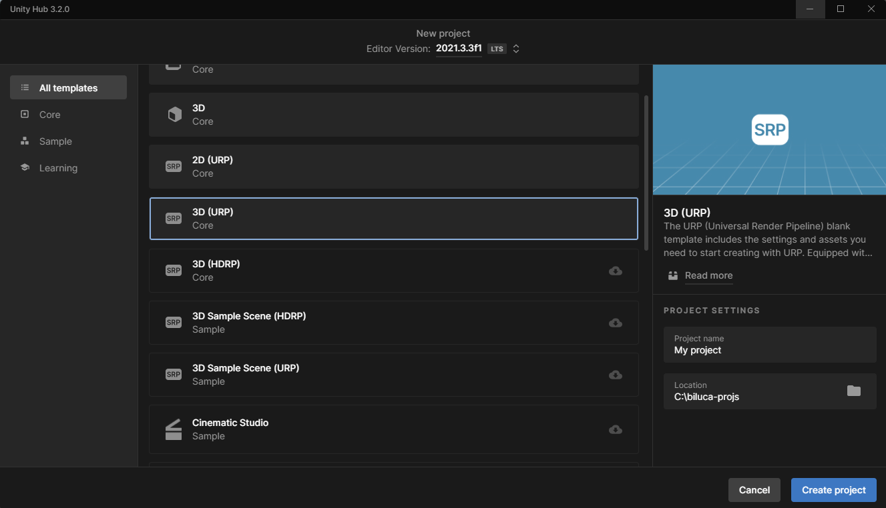
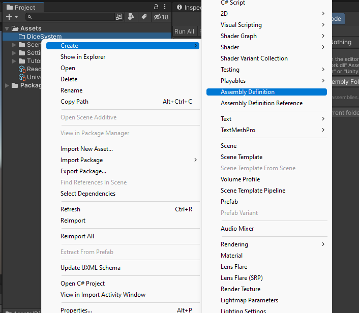
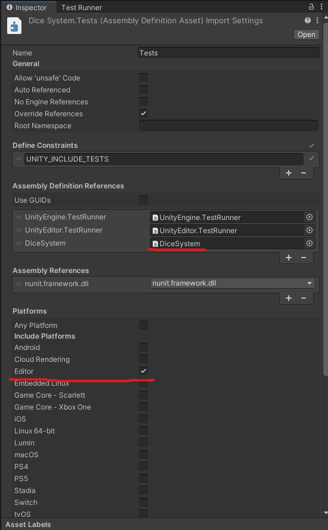
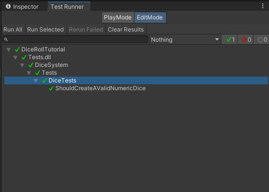
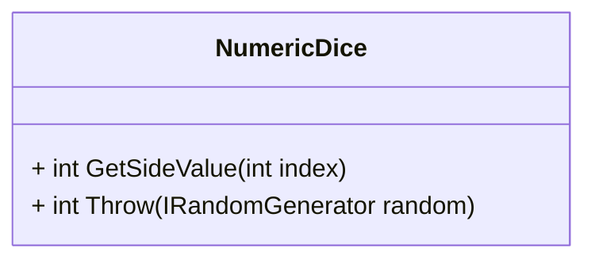

# Dice System on Unity

Hello game devs, today I will bring you a tutorial to create a **Dice System** to use in any type of game that you are thinking about making.

This tutorial will be divided into 3 parts, following the complexity of the system.

- **Part 1:** Basic Dice System in plain C#
- **Part 2:** Generic Dice System in plain C#
- **Part 3:** Physically Dice System using Unity Rigidbody physics

This tutorial will be a demonstration of my thought process to make this implementation of a Dice System. I will skip some iterations over the development process to not overflow with details and I'll try to be as much concise as possible.

I will focus on demonstrating a **high-quality and professional system**, using fundamental concepts of software development. In this tutorial, you will see concepts like **TDD, Separation of Concerns, Cohesion, Modularity and Clean Code**. The goal is not only to have a very robust Dice System for your game but learn many best practices that will help you Level Up your code skills.

This tutorial will be structured following the TDD practices, in other words, I will show you the tests with the expectation of the system and then implement the code to pass this test. Every test will bring a new feature to the system. That way we will build this system step by step, thinking every moment about our code design and the features.

# Features

Here is the list of features that the Dice System implements.

- Create a Numeric Dice with 6 sides
  - The system needs to have a way to encapsulate Dice's data
- The created dice can be thrown
  - The system needs to have a way of throwing a Dice
- The result of throwing a Dice is one of the Dice's faces
- Every time the Dice can be different

> 💡 **Quick tip:** Not all features were thought about at the beginning of the project and using TDD helped to create a more robust system only to think first about the expectation than the implementation.

# Project Setup

Create a unity project of any kind. I recommend creating a 3D (URP) project that is the now-supported type of project.



After that create a folder called `DiceSystem` in the Assets folder. Inside the DiceSystem folder create a test folder that can be called `Tests`.

With these two folders set up configure the Assembly Definitions to each folder. The assembly definitions here will be needed to run the tests.



The Tests assembly definition needs to be configured with a reference to the DiceSystem folder assembly definition.



Now the project is up and running and we can start implementing the features.

# Implementing the first feature

Let's start with the first feature: **Create a Numeric Dice with 6 sides**.

For that let's create a test that validates if the Numeric Dice was created successfully. So for that, we need to validate every Dice's side and dice's invalid sides.

```c#
using NUnit.Framework;
using System;

namespace DiceSystem.Tests
{
    public class DiceTests
    {
        [Test]
        public void ShouldCreateAValidNumericDice()
        {
            var dice = new NumericDice();

            Assert.AreEqual(1, dice.GetSideValue(0));
            Assert.AreEqual(2, dice.GetSideValue(1));
            Assert.AreEqual(3, dice.GetSideValue(2));
            Assert.AreEqual(4, dice.GetSideValue(3));
            Assert.AreEqual(5, dice.GetSideValue(4));
            Assert.AreEqual(6, dice.GetSideValue(5));

            Assert.Throws<InvalidOperationException>(() => dice.GetSideValue(-1));
            Assert.Throws<InvalidOperationException>(() => dice.GetSideValue(6));
        }
    }
}
```

With this test, we expect that the creation of a Dice is successful and it has 6 sides, each one indexed by a number. More than that we test the boundaries of the dice.

The implementation to pass this test is the following

```c#
using System;
using System.Collections.Generic;

namespace DiceSystem
{
    public class NumericDice
    {
        public readonly List<int> sides;

        public NumericDice()
        {
            sides = new List<int> { 1, 2, 3, 4, 5, 6 };
        }

        public int GetSideValue(int sideIndex)
        {
            if(sideIndex < 0 || sideIndex >= sides.Count)
                throw new InvalidOperationException();

            return sides[sideIndex];
        }
    }
}
```

With this simple implementation, we have our first test passed and the first feature tested.



# Feature: Throw the dice

First, set up the test to check if the dice were thrown. It's a simple one, the test will call the dice method to throw and then check if the return was one of its sides.

```c#
using System;
using System.Collections.Generic;

namespace DiceSystem
{
    public class NumericDiceTests
    {
        // previous code

        [Test]
        public void ShouldReturnASideWhenDiceIsThrow()
        {
            var dice = new NumericDice();

            var diceSide = dice.Throw();

            Assert.AreEqual(1, diceSide);
        }
    }
}
```

And the implementation to pass this test can be just returning one of the Dice's sides.

```c#
public class NumericDice
{
    // previous code

    public int Throw()
    {
        return 1;
    }
}
```

Continuing with the throw dice feature, the dice can be thrown multiple times generating a random result. What will it be of our dice system if it returns only one of the dice's sides every time? So let's implement the random approach using the Unity Random system.

```c#
public class NumericDice
{
    // previous code

    public int Throw()
    {
        return sides[Random.Range(0, sides.Count)];
    }
}
```

That way we will have random values every time that we throw our dice. But sometimes this will break the test that we wrote, as it tests if the returned side has the value 1.

# Adding some control over the code

Now we have random Dice that will generate different results every time. But this raises a question. How can I test the dice throw if we will have a different answer every time?

To test something that uses a random system, we need to have a way of replicating the same results every time. That way we can test the behavior of the system and not only the values that output.

Let's create the next test that will help us with this part. This test will be called `Throw()` multiple times and check their results.

```c#
public class NumericDiceTests
{
    // previous code


    [Test]
    public void ShouldReturnDifferentSidesWhenDiceIsThrowMultipleTimes()
    {
        var random = new MockRandomGenerator(new int[] { 1, 3, 0 }); // side indexes
        var dice = new NumericDice();

        Assert.AreEqual(2, dice.Throw(random));
        Assert.AreEqual(4, dice.Throw(random));
        Assert.AreEqual(1, dice.Throw(random));
    }
}
```

Of course, our test will fail because there isn't a way to select the sides that we want. Or you thought that there isn't. Now we introduce a powerful tool in our repertoire, the **Dependency inversion**. That way we can pass the dependencies to the NumericDice class that it needs. And one of the dependencies will be the `Random` class.

```c#
public class NumericDice
{
    // previous code

    public int Throw(IRandomGenerator random)
    {
        return sides[random.Range(0, sides.Count)];
    }
}
```

# Last touches

With that, we reach the end of this part. We've created one numeric dice with a random chance to throw any side and all of that can be testable with our test suite.

The final code for this part is below:

```c#
// NumericDice.cs
using System;
using System.Collections.Generic;

namespace DiceSystem
{
    public class NumericDice
    {
        private readonly List<int> sides;

        public NumericDice()
        {
            sides = new List<int> { 1, 2, 3, 4, 5, 6 };
        }

        public int GetSideValue(int sideIndex)
        {
            if(sideIndex < 0 || sideIndex >= sides.Count)
                throw new InvalidOperationException();

            return sides[sideIndex];
        }

        public int Throw(IRandomGenerator random)
        {
            return sides[random.Range(0, sides.Count)];
        }
    }
}
```

and all the tests

```c#
// DiceTests.cs
using NUnit.Framework;
using System;

namespace DiceSystem.Tests
{
    public class DiceTests
    {
        [Test]
        public void ShouldCreateAValidNumericDice()
        {
            var dice = new NumericDice();

            Assert.AreEqual(1, dice.GetSideValue(0));
            Assert.AreEqual(2, dice.GetSideValue(1));
            Assert.AreEqual(3, dice.GetSideValue(2));
            Assert.AreEqual(4, dice.GetSideValue(3));
            Assert.AreEqual(5, dice.GetSideValue(4));
            Assert.AreEqual(6, dice.GetSideValue(5));

            Assert.Throws<InvalidOperationException>(() => dice.GetSideValue(-1));
            Assert.Throws<InvalidOperationException>(() => dice.GetSideValue(6));
        }

        [Test]
        public void ShouldReturnASideWhenDiceIsThrow()
        {
            var random = new MockRandomGenerator(new int[] { 0 });
            var dice = new NumericDice();

            var diceSide = dice.Throw(random);

            Assert.AreEqual(1, diceSide);
        }

        [Test]
        public void ShouldReturnDifferentSidesWhenDiceIsThrowMultipleTimes()
        {
            var random = new MockRandomGenerator(new int[] { 1, 3, 0 });
            var dice = new NumericDice();

            Assert.AreEqual(2, dice.Throw(random));
            Assert.AreEqual(4, dice.Throw(random));
            Assert.AreEqual(1, dice.Throw(random));
        }
    }
}
```

In the next part, we will expand this code to a more generic approach. With that, we will have a system to throw different dice types.

# Class Diagram

The finished Class Diagram for this tutorial part is:



# Appendix

## Assembly Definition

## Test Runner

Explain about Edit mode and why it will be used for the whole tutorial.
