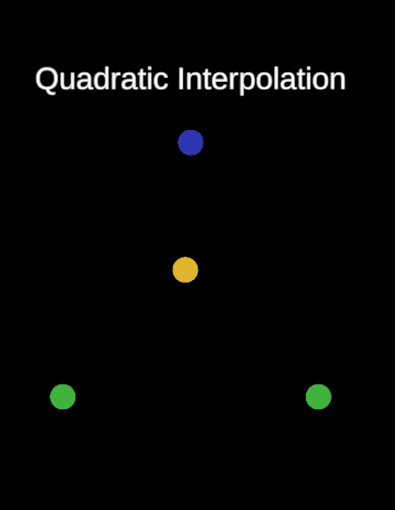
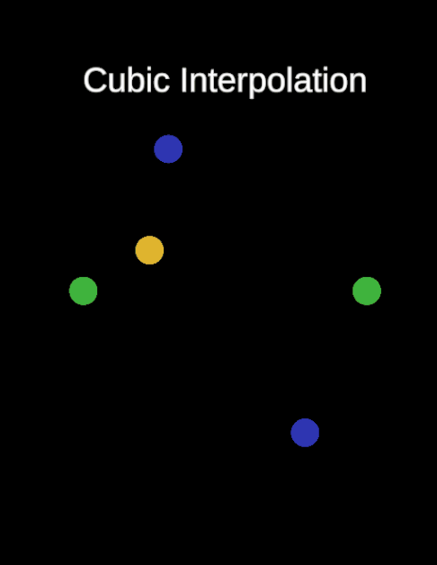
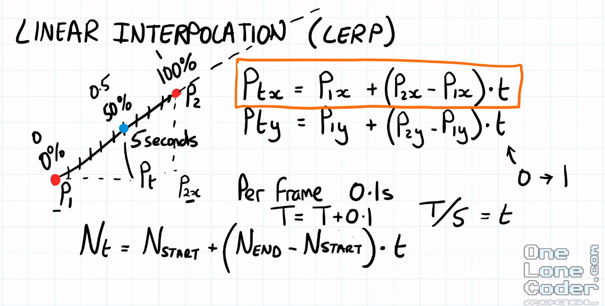
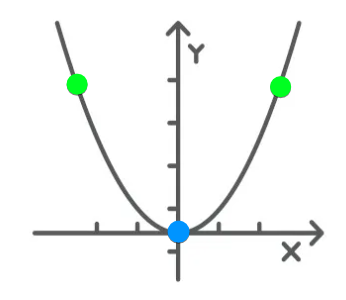
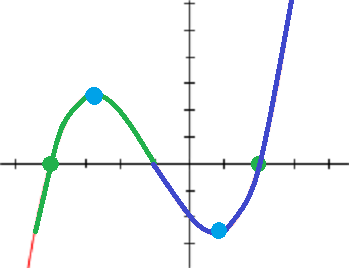

<style>
td, th {
   border: none!important;
}
img {
    display:block;
    float:none;
    margin-left:auto;
    margin-right:auto;
    width: auto;
    height: 400px; 
}
blockquote {
  padding: 12px 20px;
  border-radius: 20px;
}
</style>

# Interpolação linear na Unity  <!-- omit in toc -->

- [Matemática da Interpolação Linear](#matemática-da-interpolação-linear)
    - [Exemplo de cálculo da interpolação linear para uma função quadrática](#exemplo-de-cálculo-da-interpolação-linear-para-uma-função-quadrática)
- [Função Lerp na Unity](#função-lerp-na-unity)
- [Criando uma função de interpolação quadrática](#criando-uma-função-de-interpolação-quadrática)
- [Criando uma função de interpolação cúbica](#criando-uma-função-de-interpolação-cúbica)
- [Biluca, o que tiramos disso tudo?](#biluca-o-que-tiramos-disso-tudo)
- [Código fonte](#código-fonte)

> 💡Nesse artigo você encontrará:
> - Explicação da matemática da interpolação linear
> - Principais casos de uso e seus códigos

Interpolação linear é um método muito utilizado para calcular pontos intermediários dentro de uma função linear. Isso nos permite definir um comportamento de movimentação que siga uma função estabelecida, eliminando a necessidade de definir pontos individuais. 🙋 *Mas Biluca beleza essa matemática, e o que isso significa em desenvolvimento de games?*

A interpolação linear nos permite criar funções para definir comportamento de animações, definir a movimentação de um objeto dentro do jogo de forma a definir apenas os ponto iniciais e finais pontos enquanto os intermediários são calculados, permitindo uma grande flexibilidade e dinamicidade na implementação de movimentos dentro do game.

Pegue como exemplo a implementação da movimentação de um personagem de um ponto A para um ponto B do mapa. *Como você implementaria essa movimentação?* 

Uma forma seria definir todos os pontos que o personagem irá andar do ponto A até o ponto B. Outra seria ir somando um valor a cada passo do personagem e verificar se a posição final foi alcançada. Ambas abordagem não são ideias, a primeira seria necessário definir vários passos para o personagem, caso o caminho mude precisaríamos definir novamente todos os passos. A seguindo abordagem poderia funcionar para um movimento simples, porém movimentos complexos poderiam dificultar muito a validação da posição final.

Para resolver esses tipos de problemas tempos a interpolação polinomial e é isso que vamos discutir hoje.

Ao final desse artigo teremos passado pela **matemática do método de interpolação linear** e os **principais casos de usos**. Usos como a interpolação de movimento de objetos na cena dada uma função decomposta (quebrada) em outras funções lineares, no caso as funções quadráticas e cúbicas.

| Implementação da Interpolação quadrática | Implementação da Interpolação cúbica |
| :--------------------------------------: | :----------------------------------: |
|   |   |

# Matemática da Interpolação Linear

Na matemática, Interpolação linear é um método no qual instanciamos um novo conjunto de dados utilizando interpolação polinomial em vista de construir novos pontos de dados no alcance de pontos já conhecidos ([definição da Wikipedia](https://pt.wikipedia.org/wiki/Interpola%C3%A7%C3%A3o_linear)).

Esse novos conjuntos de dados podem ser utilizados para **aproximar um comportamento de uma função complexa** que não tem uma definição direta. Assim utilizamos interpolação linear para aproximar pedaços dessa função complexa em partes lineares. Essa característica é particularmente interessante por exemplo, na criação de um **sistema de patrulha**, onde o personagem patrulha uma região inteira de forma não linear e retilínea.

Dados dois valores, pontos no espaço 2D ou 3D, vetores, vetores multidimensionais, podemos calcular qualquer valor entre esses dois valores.


*Cálculo de interpolação linear para quaisquer dois pontos retirado do vídeo [One Lone Coder - Essential Mathematics For Aspiring Game Developers](https://www.youtube.com/watch?v=DPfxjQ6sqrc&list=PLK9v9ebk627fEHJOVLR0xku-iYenE8m8X&index=12)*

Assim para uma função linear temos a seguinte definição de interpolação:

```math
N_t = N_s + (N_e - N_s) * t
```

onde,
- $N_t$ é um valor intermediário qualquer
- $N_s$ o valor inicial
- $N_e$ o valor final
- $t$ a proporção entre os pontos finais e iniciais calculados
  - $t = 0$ representa o valor inicial
  - $t = 1$ representa o valor final

### Exemplo de cálculo da interpolação linear para uma função quadrática

Dado uma função

```math
f(x) = x^2
```

E os pontos $N_s = 0$ e $N_e = 10$

Se quisermos saber qual a posição em pontos da nossa função temos

```math
\begin{gather}
& t = 0; & N_t = 0 + (10 - 0) * 0 & N_t = 0 \\
& t = 0.5; & N_t = 0 + (10 - 0) * 0.5 & N_t = 5 \\
& t = 1; & N_t = 0 + (10 - 0) * 1 & N_t = 10
\end{gather}
```

Assim conseguimos saber as posições na função que define a posição de objeto.

```math
\begin{gather}
& N_t = 0 & f(0) = 0\\
& N_t = 5 & f(5) = 25 \\
& N_t = 10 & f(10) = 100
\end{gather}
```

# Função Lerp na Unity

A Unity já possui uma função de interpolação linear entre dois pontos no espaço para utilizarmos descrita na [documentação da Unity](https://docs.unity3d.com/ScriptReference/Vector3.Lerp.html).

Iremos implementar as próximas funções utilizando essa função `Vector3.Lerp` como base, já que essa função já implementa a interpolação linear entre dois pontos.

# Criando uma função de interpolação quadrática

Como descrito na seção de matemática de uma interpolação linear, podemos utilizar esse método para aproximar o comportamento de funções mais complexa que a linear.

Para exercitar esse raciocínio vamos implementar a interpolação linear para uma função quadrática $y = x^2$. Essa função tem por comportamento o seguinte gráfico.



Assim podemos "quebrar" a função quadrática em duas partes. A primeira parte levará como ponto inicial o círculo verde mais a esquerda e o ponto final o círculo azul. A segunda parte levará como ponto inicial o círculo azul e o ponto final o círculo verde mais a direita. Combinando essas duas funções temos uma aproximação da função de interpolação linear para uma função quadrática.

```csharp
public static Vector3 Quadratic(Vector3 a, Vector3 b, Vector3 c, float t)
{
    var ab = Vector3.Lerp(a, b, t);
    var bc = Vector3.Lerp(b, c, t);

    return Vector3.Lerp(ab, bc, t);
}
```

A implementação dessa função nos leva ao seguinte resultado


```csharp
public class QuadraticLerpDemo : MonoBehaviour
{
    [SerializeField] private GameObject start;
    [SerializeField] private GameObject mid;
    [SerializeField] private GameObject end;

    [SerializeField] private GameObject refObject;

    private float interpolationAmount = 0f;

    public void Update()
    {
        interpolationAmount += Time.deltaTime;

        if(interpolationAmount >= 1f)
            interpolationAmount = 0f;

        refObject.transform.position = LinearInterpolation.Quadratic(
            start.transform.position,
            mid.transform.position,
            end.transform.position,
            interpolationAmount
        );
    }
}
```

Nessa imagem vemos em verde os pontos iniciais e finais do nosso movimento. O ponto em azul é o ponto intermediário. A bolinha amarela irá seguir o ponto azul e com isso conseguimos criar vários outros tipos de padrões de movimentos interessantes.

# Criando uma função de interpolação cúbica

Agora que já criamos uma função quadrática podemos dar um próximo passo e criar uma função cúbica definida por $y = x^3$ e com o seguinte comportamento conforme o seguinte gráfico.



Olhando bem para esse gráfico, em que tipo de funções podemos "quebrar" a função cúbica para implementarmos seu respectivo comportamento? Se você falou duas funções quadráticas acertou em cheio. (🙋 Agora me diga, as cores do gráfico ajudaram?)

Da mesma forma que decompomos a função quadrática em duas funções cúbicas agora vamos decompor a função cúbica em duas interpolações lineares de funções quadráticas.

```csharp
  public static Vector3 Cubic(Vector3 a, Vector3 b, Vector3 c, Vector3 d, float t)
  {
      var abc = Quadratic(a, b, c, t);
      var bcd = Quadratic(b, c, d, t);
      return Vector3.Lerp(abc, bcd, t);
  }
```

Com isso já podemos utilizar em nossa cena a função cúbica de interpolação e conseguimos o seguinte comportamento.


```csharp
public class CubicLerpDemo : MonoBehaviour
{
    [SerializeField] private GameObject start;
    [SerializeField] private GameObject mid;
    [SerializeField] private GameObject mid2;
    [SerializeField] private GameObject end;

    [SerializeField] private GameObject refObject;

    private float interpolationAmount = 0f;

    public void Update()
    {
        interpolationAmount += Time.deltaTime;

        if(interpolationAmount >= 1f)
            interpolationAmount = 0f;

        refObject.transform.position = LinearInterpolation.Cubic(
            start.transform.position,
            mid.transform.position,
            mid2.transform.position,
            end.transform.position,
            interpolationAmount
        );
    }
}
```

# Biluca, o que tiramos disso tudo?

Como podemos ver interpolação linear é um método muito poderoso para criar movimentação de forma programática em um jogo. Demonstramos aqui hoje com alguns exemplos de movimentação de objetos em uma cena de duas formas diferentes, porém esse conceito pode ser facilmente expandido para qualquer tipo de comportamento desejado.

Com interpolação linear podemos definir a movimentação de personagens e qualquer outros tipo de objetos na cena. Eu particularmente utilizo bastante para calcular projeção de projéteis na cena, como granadas, bolas de fogo, tiros rápidos e qualquer outro tipo de pirotecnia. Podemos até pensar num próximo artigo para implementarmos esse tipo funcionalidade.

No mais é isso, muito obrigado por quem leu esse artigo e um abraço. Até o próximo 👋.

# Código fonte

- [Código das funções de interpolação linear](https://github.com/BrunoBiluca/UnityFoundation/blob/main/Code/Math/LinearInterpolation/LinearInterpolation.cs)
- [Código da demonstração de interpolação linear](https://github.com/BrunoBiluca/unity-foundation-samples/tree/main/Assets/UnityFoundationSamples/UnityFoundation.Code/Math)

