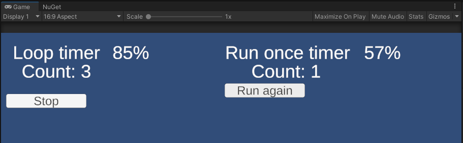
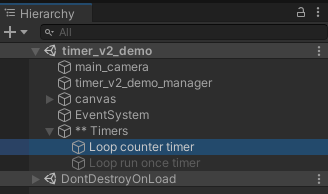

# Como fazer um Timer definitivo na Unity

## Considerações pré leitura

O artigo terá como foco a engine de desenvolvimento de games **Unity**, porém acredito que o conceito pode ser aplicado a qualquer engine **(talvez no futuro faça a comparação com outras engines, me digam se vocês acham interessante)**.

O artigo irá conter todas as classes e estruturas já com o código final, a fim de deixar o artigo mais conciso, para mais detalhes e uma abordagem mais passo a passo comentem se vocês gostariam de ver esse timer implementado em um video.

# Introdução: para que usamos timers em video games?

No artigo de hoje vamos explorar um pouco mais o conceito de **Timers**, elemento muito aplicado no desenvolvimento de games em geral.

> Timer é uma estrutura que depois de um tempo pré determinado, informa de seu término ou executa uma ação.

Timers são muito utilizados para programar ações da inteligência artificial dos inimigos, 
adicionar cooldowns para limitar o uso de certas funcionalidades, 
ou até determinar eventos que ocorrem de tempos em tempos dentro da fase do jogo.

{:markdowmImage}

Então a dúvida que fica é: como faço para contar tempo dentro de um jogo usando a engine Unity? 

Utilizando a Unity conheço duas formas de contabilizar o tempo:

- Verificar o horário real no sistema e comparar com uma data previamente armazenada.
- Acumular a quantidade de tempo passado a cada frame

A segunda forma é a mais utilizada, pois podemos padronizar aspectos dentro do jogo independentemente da quantidade de frames que o jogo está sendo executado de máquina para máquina naquele momento, mantendo assim uma experiência mais consistente para o jogador.

# Arquitetura da solução

Existem várias formas de implementar um timer na Unity. Como vocês podem estar familiarizados a implementação mais comum encontrada, é a seguinte:

```csharp
public class SomeClass : MonoBehaviour
{
    private float timerMax;
    private float timer;

    private void Update()
    {
        timer += Time.deltaTime;
        if(timer < timerMax) return;
        timer = 0f;

        // do some cool stuff...
    }
}
```

Essa solução funciona muito bem para **situações simples** que contamos com um único timer na classe, porém quando estamos implementando um personagem com várias skills e cada skill tem o seu próprio timer de cooldown essa classe começa a ficar uma bagunça, já que teríamos várias variáveis de controle e precisaríamos gerenciar cada uma delas.

```csharp
public class SomeClass : MonoBehaviour
{
    private float timerMax;
    private float timer;

    private float timerMax2;
    private float timer2;

    private float timerMax3;
    private float timer3;

    private void Update()
    {
        ResolveTimer1();
        ResolveTimer2();
        ResolveTimer3();
    }

    private void ResolveTimer1(){
        timer += Time.deltaTime;
        if(timer < timerMax) return;
        timer = 0f;
        // do some cool stuff...
    }

    private void ResolveTimer2(){
        timer2 += Time.deltaTime;
        if(timer2 < timerMax2) return;
        timer2 = 0f;
        // do other cool stuff...
    }

    private void ResolveTimer3(){
        timer3 += Time.deltaTime;
        if(timer3 < timerMax3) return;
        timer3 = 0f;
        // do more cool stuff...
    }

}
```


A arquitetura que estou propondo nesse artigo visa o desacoplamento da lógica de timer em uma classe separada chamada `Timer`, possibilitando assim uma **maior flexibilidade e reuso de código ao mesmo tempo que evita duplicação de código no mesmo projeto**.

Antes de começar a implementação vamos voltar um passo atrás e pensar em quais funcionalidades precisamos que um Timer faça, ou seja, precisamos planejar a API que o nosso Timer irá expor para quem for utilizar (planejar a API antes de implementar as funcionalidades ajuda muito a criar um software mais robusto e de qualidade).

```csharp
class Timer 
{
    // Construtor do nosso Timer
    // amount: quantidade de tempo até o timer ser finalizado
    // callback: callback executado quando o timer é finalizado
    Timer(float amount, Action callback); 

    Start();    // Começa a contabilizar o tempo do início
    Stop();     // Para de contabilizar o tempo
    Resume();   // Retorna a contabilizar o tempo
    Close()     // Finaliza o timer
} 
```

Pronto, com essa API já conseguimos começar a implementar a nossa funcionalidade de timer.

# Contando o tempo

Agora precisamos aprender como vamos contabilizar o tempo dentro da Unity. 

Como explicado anteriormente vamos utilizar o acumulado de tempo passado a cada frame para saber se o nosso timer chegou ao fim ou ainda está ativo. Para isso precisamos de ter um objeto na cena que **herde de MonoBehaviour**, a fim de ter acessso ao método `Update()` que é executado a cada frame pela Unity.

```csharp
public class TimerMonoBehaviour : MonoBehaviour
{
    [SerializeField] private bool loop;
    [SerializeField] private bool selfDestroyAfterComplete;
    [SerializeField] private float timerMax;

    [SerializeField] private float timer;
    public float Timer {
        get { return timer; }
        set { timer = value; }
    }

    public bool IsRunning => gameObject.activeInHierarchy;

    private Action callback;

    public void Setup(float amount, Action callback, bool loop = true)
    {
        timer = 0f;
        timerMax = amount;
        this.callback = callback;
        this.loop = loop;

        gameObject.SetActive(true);
    }

    public void Activate()
    {
        gameObject.SetActive(true);
    }

    public void Deactivate()
    {
        gameObject.SetActive(false);
    }

    public void Close()
    {
        if(gameObject == null) return;
        Destroy(gameObject);
    }

    private void Update()
    {
        timer += Time.deltaTime;

        if(timer < timerMax) return;

        timer = 0f;
        try
        {
            callback();
            if(!loop) Deactivate();
        }
        catch(MissingReferenceException)
        {
            Close();
        }
    }
}
```

A classe ```TimerMonoBehaviour``` é a classe que irá ser responsável por gerenciar o tempo do Timer dentro da Unity, já que é a única classe MonoBehaviour dentro da nossa solução. Se você reparar direito ele é exatamente a implementação da solução base encontrada de criação de um timer, porém delegando o que será executado para o `callback()` (quem criou o timer).

Podemos observar também que a lógica do nosso timer é executada pela Unity uma vez por frame no método `Update()`, esse é o método que contabiliza o tempo passado pelo timer.

Foram implementados 2 modos de Timer, esses modos são indicados pela campo `loop`:

- Modo loop (`loop=true`): reseta o acumulador quando a chega ao valor de tempo pretendido
- Modo runOnce (`loop=false`): desativa o gameObject quando chega ao valor de tempo pretendido.

Public API:

- `Setup(float amount, Action callback, bool loop = true)`
  - Seta as configurações do timer, como quantidade de tempo para acumular, ou modo de execução (loop, runOnce)
- `Activate()`
  - Ativa o timer, retorna a contabilizar o tempo
- `Deactivate()`
  - Desativa o timer, para de contabilizar o tempo
- `Close()`
  - Destrói o gameObject do timer

# Finalmente o Timer

Ótimo agora que já temos um nosso acumulador de tempo podemos seguir para criar a classe de `Timer`, essa será a classe utilizada amplamente em nosso código na necessidade de verificar períodos de tempos em nosso código.

```csharp
public class Timer
{
    private static GameObject timersReference;

    private static void TryGetTimersReference() // Método estático para criar ou buscar a referência do objeto ** Timers
    {
        if(timersReference != null) return;

        var timersRef = GameObject.Find("** Timers");
        if(timersRef == null)
        {
            timersRef = new GameObject("** Timers");
        }

        timersReference = timersRef;
    }

    // Algumas propriedades interessante de ter acesso durante a execução de um Timer
    public float CurrentTime { get { return timerBehaviour.Timer; } }
    public float RemainingTime { get { return amount - timerBehaviour.Timer; } }
    public float Completion { get { return CurrentTime / amount * 100f; } }
    public bool IsRunning { get { return timerBehaviour != null && timerBehaviour.IsRunning; } }

    private TimerMonoBehaviour timerBehaviour;
    private string name;
    private readonly float amount;
    private bool isLoop;
    private readonly Action callback;

    // Construtor base
    public Timer(float amount, Action callback)
    {
        this.amount = amount;
        this.callback = callback;

        isLoop = true;
    }

    public Timer SetName(string name)
    {
        this.name = name;
        return this;
    }

    public Timer RunOnce() // Habilita o modo RunOnce do Timer
    {
        isLoop = false;
        return this;
    }

    public Timer Loop()  // Habilita o modo Loop do Timer
    {
        isLoop = true;
        return this;
    }

    public Timer Start() // Inicia a contagem do tempo
    {
        if(timerBehaviour == null)
            InstantiateTimer();

        timerBehaviour.Setup(amount, callback, isLoop);

        return this;
    }

    public void Stop() // Para a contagem do tempo
    {
        timerBehaviour.Deactivate();
    }

    public void Resume() // Retorna a contagem do tempo de onde parou
    {
        timerBehaviour.Activate();
    }

    public void Close() // Finaliza a contagem do tempo
    {
        if(timerBehaviour == null) return;
        timerBehaviour.Close();
    }

    private void InstantiateTimer()
    {
        TryGetTimersReference();

        if(string.IsNullOrEmpty(name)) name = Guid.NewGuid().ToString();

        timerBehaviour = new GameObject(name).AddComponent<TimerMonoBehaviour>();
        timerBehaviour.transform.SetParent(timersReference.transform);
    }
}
```

Como podemos ver a nossa classe `Timer` gerencia, por meio da API planejada inicialmente, o `TimerMonoBehaviour` para contabilizar o tempo passado.

Utilizando essa classe podemos fazer a 4 operações inicialmente planejadas:

- `Start()`
- `Stop()`
- `Resume()`
- `Close()`

Dessa forma não precisamos mais de reimplementar a lógica de contabilizar tempo no nosso jogo, já que esse Timer já faz isso para nós.

## Utilização do Timer

Com todas as ferramentas na mão, podemos agora utilizar de vez o nosso timer e verificar se o nosso objetivo de criar um código desacoplado e de fácil reuso foi concluído. 

Para o teste de nosso timer podemos implementar uma cena com dois contadores um para cada modo do Timer, cada contador será incrementado ao final do tempo do timer.



Cada um desses contadores é atualizado da seguinte forma, utilizando um gerenciador na cena.

```csharp

// Executa o callback de 5 em 5 segundos, sem interrupções
loopTimer = new Timer(
    5f, 
    () => {
        loopCounter++;
        loopCounterText.text = $"Count: {loopCounter}";
    })
    .SetName("Loop counter timer")
    .Loop()
    .Start();

// Executa o callback após 5 segundos e se desativa
runOnceTimer = new Timer(
    5f, 
    () => {
        runOnceCounter++;
        runCounterText.text = $"Count: {runOnceCounter}";
    })
    .SetName("Loop run once timer")
    .RunOnce()
    .Start();
```

## Conclusão

Depois dessa trabalheira toda podemos avaliar a nossa solução.

Conseguimos encapsular toda a lógica de execução do timer nas classes `Timer` e `TimerMonoBehaviour`, dessa forma podemos reutilizar o código criado em qualquer lugar do projeto apenas com um `new Timer()`.

Também conseguimos aumentar a flexibilidade da solução adicionando múltiplos modos de Timers (loop ou runOnce), que podem ser facilmente gerenciados pela API pública da classe `Timer`, possibilitando assim utilizar a mesma implementação em situações adversas.

Por fim, sem muito esforço conseguimos adicionar funcionalidades ao nosso Timer, como a possibilidade de Stop/Resume e até de reiniciar o timer a medida que precisamos.


Para você que chegou aqui muito obrigado pela leitura e qualquer dúvidas não deixe de comentar. Também não deixe de dar uma Estrela para o projeto no Github para seguir o projeto que tem muito mais coisas legais lá.

# Repositório

O projeto de demonstração da utilização da ferramenta de Timer criada segue no link [Github](https://github.com/BrunoBiluca/UnityFoundationTest). Para acessar a demonstração é necessário apenas abrir cena `Assets/Scenes/Code/TimeUtils/timer_v2_demo.unity`.

O código das ferramentas criadas pode ser encontrado no link [Github](https://github.com/BrunoBiluca/UnityFoundation/tree/main/Code/TimeUtils).

# Apêndice

Aqui vou deixar algumas considerações secundárias a respeito do nosso pequeno projeto.

- Para facilitar a visualização dos timers criados nas cenas na Unity, foi criado o método `TryGetTimersReference()` esse método busca a referência de um objeto chamado `** Timers` dentro da cena, todos o TimerMonoBehaviour são então criados como filhos desse objeto para facilizar visualização.



