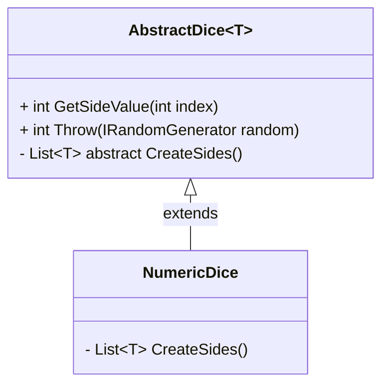

# Dice Tutorial Part 2

- [Dice Tutorial Part 2](#dice-tutorial-part-2)
  - [Generics in C#](#generics-in-c)
  - [Converting int Dice to a generic Dice](#converting-int-dice-to-a-generic-dice)
  - [Class Diagram](#class-diagram)
- [References](#references)

Today in this tutorial we will convert the Dice System created in the last part of this series of tutorials to a generic approach. With that will be possible to create dice of any type. But first, let's make a quick reminder of **Generics in C#**.

## Generics in C#

Generic are like parameters passing to classes and methods. With generics the compiler delay the type checking until the user declare or instantiate.

Using generics it is possible to create any logic and apply that to different types without any code change.

Generic class declaration:

```c#

// Generic class
public class A<T> {
  public T value;
}

// Usage

var aInt = new A<int>();
aInt.value = 123;

var aFloat = new A<float>();
aFloat.value = 123f;

var aString = new A<string()>();
aString.value = "123";
```

Declaring a class or method generic add a huge flexibility to the code. Aside from primitive types it is possible to pass another class to the generic type.

```c#
public class A<T> {
  public T value;
}

public class Value {
  public int a;
  public string b;
}

// Usage

var generic = new A<Value>();
generic.value = new Value();

generic.value.a; // a from Value class
generic.value.b; // b from Value class
```

And with that I think you are getting where I want to reach with that. Applying generics to the Dice logic will increase the flexibility and allow us to use the same logic for any type.

## Converting int Dice to a generic Dice

Let's remember the code that we left in the previous part.

```c#
// NumericDice.cs
using System;
using System.Collections.Generic;

namespace DiceSystem
{
    public class NumericDice
    {
        private readonly List<int> sides;

        public NumericDice()
        {
            sides = new List<int> { 1, 2, 3, 4, 5, 6 };
        }

        public int GetSideValue(int sideIndex)
        {
            if(sideIndex < 0 || sideIndex >= sides.Count)
                throw new InvalidOperationException();

            return sides[sideIndex];
        }

        public int Throw(IRandomGenerator random)
        {
            return sides[random.Range(0, sides.Count)];
        }
    }
}
```

That structure will continue the same, but now we need to refactor this code to a generic approach. Let's create a abstract class call `AbstractDice`, this class will be the template for every dice created in the game and will implement the logic of behind the `GetSideValue` and `Throw` methods. Everything related to the type will be implemented in the concrete class.

```c#
// AbstractDice.cs
using System;
using System.Collections.Generic;

namespace DiceSystem
{
    public abstract class AbstractDice<T>
    {
        private readonly List<T> sides;

        public NumericDice()
        {
            sides = CreateSides();
        }

        public T GetSideValue(int sideIndex)
        {
            if(sideIndex < 0 || sideIndex >= sides.Count)
                throw new InvalidOperationException();

            return sides[sideIndex];
        }

        public T Throw(IRandomGenerator random)
        {
            return sides[random.Range(0, sides.Count)];
        }

        protected abstract List<T> CreateSides();
    }
}
```

Now we need a way of testing this class. In this case the behavior of a abstract class can be **tested by a concrete class**, and the code has already a concrete class candidate to the abstract class, the `NumericDice`. So we can use the same test case to the NumericDice to the AbstractDice. What we need to do is refactoring the NumericDice to extend the AbstractDice.

```c#
// NewNumericDice.cs
using System;
using System.Collections.Generic;

namespace DiceSystem
{
    public class NumericDice : AbstractDice<int>
    {
      protected List<int> CreateSides(){
        return new List<int> { 1, 2, 3, 4, 5, 6 };
      }
    }
}
```

Look how much simpler the new class is compared with the previous version. The only thing that the concrete class needs to implement is the actual sides that the dice have.

Now the tests previously implemented for the NumericDice need to behavior the same way that before, as we didn't change or add any behavior to the Dice Logic.

## Class Diagram

The finished Class Diagram for this tutorial part is:



# References

- #### [Generic classes and methods](https://docs.microsoft.com/pt-br/dotnet/csharp/fundamentals/types/generics)