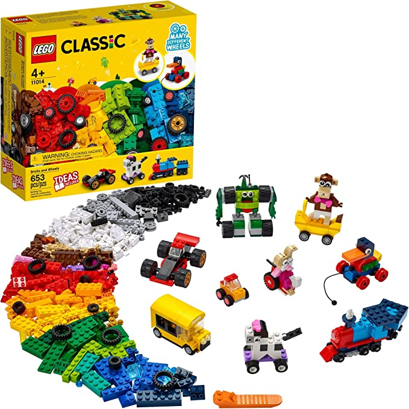
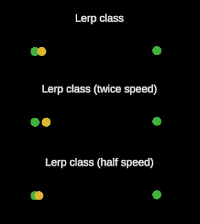
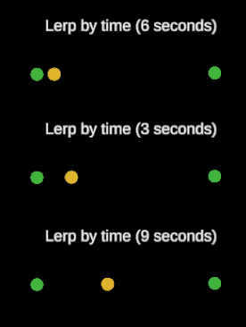

# Modularizando a Interpolação linear

> 💡Nesse artigo você encontrará:
> - Importância da modularização de código
> - Implementação de interpolação linear por tempo ou por quantidade

A modularização de código é um mecanismo que visa separar em múltiplas partes o nosso sistema, onde essas partes podem ser combinadas entre si para gerar diferentes resultados. É como se pensássemos no jogo a ser desenvolvido como um grande quebra cabeça, onde nós construímos as peças e podemos definir seus formatos. Todas essas peças no propiciam vários resultados diferentes.



> 🐶 **Pense comigo:** Para explicar um pouco mais o conceito de modularização vamos pensar em um componente simples do nosso sistema, como por exemplo a vida do nosso personagem principal. 

Quando um inimigo atacar o herói o seu valor de vida deve ser diminuído. Caso sua vida chegue a zero o herói irá falecer e é fim de jogo. 

Vamos chamar o script que implementa esse comportamento de Hero e implementar uma classe que define o seu estado.

```csharp
public class Hero {
  public int health; // Vida do nosso personagem
}
```

Caso um inimigo, nesse caso um Zombie, ataque esse player ele deve ter sua vida diminuída. Podemos implementar essa interação da seguinte forma:

```csharp
public class Zombie {
  public void Attack(){
    hero.health -= damage;
  }
}
```

Digamos que também existam outros inimigos em nosso jogo, como um Ghoul, um Vampiro, ou qualquer outro tipo de inimigo, teremos que implementar a lógica de diminuição de vida em cada uma dessas entidades. Ou seja, estamos replicando código por todo o nosso projeto.

Caso quisermos alterar esse lógica, por exemplo adicionando um atributo de defesa que reduz o dano causado ao player será necessário alterar todos os pontos do código onde a lógica de diminuição de vida está implementada.

Para resolver esse problema comum em programação, podemos utilizar a modularização. Separando a vida do player em um módulo é necessário apenas implementar uma única vez esse comportamento e a partir daí referenciar por todos os outros pontos de nosso código. Um exemplo dessa implementação seria alterar o código que temos para:

```csharp
public class Hero {
  private int health; // Vida do nosso personagem

  public void Damage(int damage){
    health -= damage;
  }
```

Onde assim cada inimigo irá apenas referenciar o método `Damage()`.

```csharp
public class Zombie {
  public void Attack(){
    hero.Damage(damage);
  }
}
```

Esse é o poder da modularização. Utilizando esse conceito vamos modularizar dois tipo de Interpolação linear, uma baseada na quantidade da interpolação e outra baseada no tempo decorrido.

A imagem abaixo demonstra um exemplo das duas formas de interpolação implementadas nesse artigo.

# Interpolação linear pequeno resumo

Como já expliquei no artigo de interpolação linear, utilizando uma função polinomial podemos interpolar quaisquer dois pontos.

A própria Unity já nos fornece uma função de interpolação que podemos utilizar.

```csharp
Mathf.Lerp(startValue, endValue, interpolationAmount);
```

Onde o interpolationAmount é dado de `(0, 1)` onde 0 significa o ponto inicial e 1 o ponto final.

A implementação mais comum utilizada na Unity, é utilizar a variação de tempo para acumular a quantidade de interpolação. Assim a cada frame temos o acumulo do interpolationAmount deixando a animação bem mais fluída. 

Esse tipo de implementação pode ser feita da seguinte maneira.

```csharp
public class LerpDemo : MonoBehaviour {

  private float startValue = 0;
  private float endValue = 10;
  private float interpolationAmount;
  private float interpolationResult;

  public void Update(){
    interpolationAmount += Time.deltaTime;
    interpolationResult = Mathf.Lerp(startValue, endValue, interpolationAmount);
  }
}
```

É um código simples, porém para cada script diferente será necessário replicar essa implementação. Esse é um ótimo candidato para aplicarmos a modularização.

Para resolver esse problema vamos modularizar esse conceito de interpolação em sua própria classe e garantir que nosso projeto utilize a classe desenvolvida, melhorando e muito a organização e consistência do nosso projeto.

# Interpolação linear modularizada por quantidade

Nossa primeira modularização será para construir uma classe que encapsule a lógica de interpolação.

Também queremos adicionar mais algumas funcionalidades a essa classe:

- Possibilidade de ter uma interpolação em Loop, ou seja, quando a interpolação alcança seu valor final seu estado é resetado.
- Possibilidade de configurar uma velocidade de interpolação, essa velocidade determina a cadência da interpolação.

Com essas necessidade em mente podemos implementar a classe `LerpByValue` que define cada um dos requisitos desejados. Perceba que a implementação base é muito parecida com o que foi desenvolvido no `LerpDemo`.

```csharp
public class LerpByValue
{
    private float startValue;
    private float endValue;
    private float range;
    private float currentInterpolationAmount;

    public float InterpolationSpeed { get; set; } = 1f;
    public bool Looping { get; set; } = false;

    public LerpByValue(float startValue, float endValue)
    {
        this.startValue = startValue;
        this.endValue = endValue;
        range = MathX.Distance(startValue, endValue);
    }

    public void ResetInterpolation()
    {
        currentInterpolationAmount = 0f;
    }

    /// <summary>
    /// Evaluate the interpolation increase by an amount between start and end values.
    /// </summary>
    public float Eval(float value)
    {
        var amount = value / range;
        currentInterpolationAmount += amount * InterpolationSpeed;

        if(Looping)
            if(currentInterpolationAmount > 1f)
                ResetInterpolation();

        return Mathf.Lerp(startValue, endValue, currentInterpolationAmount);
    }
}
```

Também perceba como depois que modularizamos o conceito de interpolação em uma classe separada fica mais simples de adicionar novos comportamentos.

Adicionamos uma função pública para caso seja interessante recomeçar o movimento e também um comportamento de Loop, que recomeça o movimento quando a interpolação chega no valor final.

Como modularizamos a interpolação em sua classe é necessário alterar a implementação do `LerpDemo` para agora utilizar essa implementação.

```csharp
public class LerpDemo {
  private LerpByValue lerp;

  public void Awake(){
    lerp = new LerpByValue(startValue: 0, endValue: 1) { Looping = true, InterpolationSpeed = interpolationSpeed };
  }

  public void Update(){
    lerp.Eval(Time.deltaTime);
  }
}
```

Por fim, uma outra vantagem da modularização é o seu encapsulamento. Perceba que o cliente, no caso a classe `LerpDemo`, que utiliza a classe `LerpByValue` não precisa conhecer como a classe foi implementada para a utilizar. Quando isso acontece falamos que a funcionalidade está escondida pela interface. E a própria interface da classe nos fornece informações suficientes para conseguirmos utilizá-la.

A imagem abaixo mostra a execução do `LerpDemo` em cena dentro da Unity.



# Interpolação linear modularizada por tempo

Para a modularização baseada em tempo vamos seguir um caminho similar ao feito na classe `LerpByValue`, porém aqui estamos preocupados com o tempo necessário para concluir a interpolação e não a quantidade.

```csharp
public class LerpByTime
{
    public float StartValue { get; }
    public float EndValue { get; }
    public float CurrentValue { get; private set; }
    public float CurrentTime { get; private set; }
    public float Time { get; }

    public bool Looping { get; set; } = false;

    public LerpByTime(float startValue, float endValue, float time)
    {
        StartValue = startValue;
        CurrentValue = startValue;
        EndValue = endValue;
        Time = time;
    }

    public void Eval(float timeAmount)
    {
        CurrentTime += timeAmount;

        if(Looping)
            if(CurrentTime >= Time)
                CurrentTime = 0;

        CurrentValue = Mathf.Lerp(
            StartValue,
            EndValue,
            CurrentTime / Time
        );
    }
}
```

Essa implementação garante que a interpolação irá ser concluída em relação ao tempo passado.

```csharp
public class LerpByTimeDemo : MonoBehaviour
{
    private LerpByTime lerp;

    public void Awake()
    {
        lerp = new LerpByTime(startValue: 0, endValue: 1, time: 2) { Looping = true };
    }

    public void Update()
    {
        lerp.Eval(Time.deltaTime);
    }
}
```

A imagem abaixo demonstra a execução da classe `LerpByTime` em uma cena da Unity.



# Biluca, o que tiramos disso tudo?

Utilizando da modularização conseguimos pensar o nosso software como vários pedaços. Isso nos ajuda em vários pontos, entidade de software menores são mais simples de testar, evoluir e manter. Além disso também podemos combinar esses pequenos pedaços e formarmos múltiplos comportamentos sem a necessidade de implementar código novo.

A interpolação linear é um método muito utilizado principalmente para garantir movimentação de objetos, então é um ótimo candidato para esse tipo de modularização.

Por fim, podemos expandir o que foi aplicado nesse artigo para qualquer outra parte do nosso sistema a fim de garantir um desenvolvimento de software mais organizado e consistente, além de com menos bugs.

# Referências

- [Cena com várias implementações de interpolação linear](https://github.com/BrunoBiluca/unity-foundation-samples/tree/main/Assets/UnityFoundationSamples/UnityFoundation.Code/Math)
- [Código completo da classe LerpByValue](https://github.com/BrunoBiluca/UnityFoundation/blob/main/Code/Math/LinearInterpolation/LerpByValue.cs)
- [Código completo da classe LerpByTime](https://github.com/BrunoBiluca/UnityFoundation/blob/main/Code/Math/LinearInterpolation/LerpByTime.cs)
- [UnityFoundation](https://github.com/BrunoBiluca/UnityFoundation)