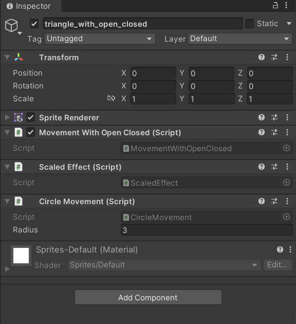
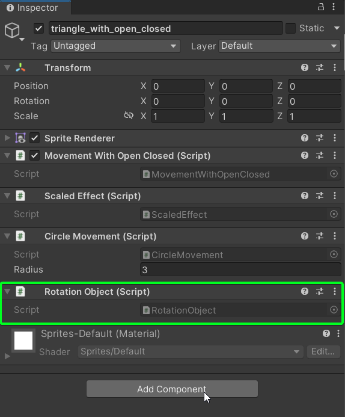

> 💡Nesse artigo você encontrará:
> - Definição do princípio
> - Implementação do princípio em um caso

O princípio Open-Closed (Aberto-Fechado) é o segundo princípio definido no conjunto SOLID. Esse princípio tem como objetivo definir que comportamentos dentro do código sejam estendidos em vez de modificados visando assim diminuir a quebra de funcionalidades anteriormente finalizadas e adição de bugs no sistema.

>  📝 Definição: uma entidade de software (classe, módulo, função, método) deve ser aberto para extensão e fechado para modificação.

Ou seja, entidades de software devem possibilitar sua expansão ao adicionar outras funcionalidades ao sistema, sem que nenhuma modificação seja feita nas entidades já finalizadas.

Essa extensão deve ser possibilitada por qualquer entidade de software. Um método pode ser chamado por outro que adicione funcionalidade, um classe pode herdar de outra de forma a adicionar funcionalidade, um módulo inteiro pode estender outro módulo.

A principais vantagens da utilização do princípio são:

- Flexibilização das funcionalidades do código (veremos sobre isso na seção de Combinações possíveis)
- Minimizar a inserção de bugs e comportamentos inesperados no código

Para demonstrar esse conceito na prática vamos explorar o seguinte cenário:

Dado um objeto qualquer no espaço do jogo queremos aplicar operações diversas que transformem seu aspecto como posição, rotação e escalonamento. O que queremos implementar ao final é uma cena da seguinte maneira:


# Implementando a primeira versão do Jogo

Na primeira versão do jogo iremos implementar as seguintes funcionalidades:

- O objeto irá se movimentar em círculo na tela
- Enquanto o objeto se movimento ele será expandido e contraído

Para a primeira funcionalidade implementada iremos implementar a movimentação do objeto em círculo. Dessa forma criamos então uma classe para implementar esse movimento.

Para o cálculo do objeto e círculo podemos utilizar a combinação das funções Seno e Cosseno que definem um movimento circular.

```csharp
public class MovementWithoutOpenClosed : MonoBehaviour
{
    float radius = 3f;
    float posX = 0f;
    float posY = 0f;

    public void Update()
    {
        posX += Time.deltaTime;
        posY += Time.deltaTime;
        transform.position = new Vector3(
            Mathf.Sin(posX) * radius,
            Mathf.Cos(posY) * radius,
            0f
        );
    }
}
```

Com isso implementado já temos a primeira funcionalidade implementada.

Agora vamos implementar a segunda funcionalidade de expandir e contrair o objeto.

```csharp
public class MovementWithoutOpenClosed : MonoBehaviour
{
    float radius = 3f;
    float posX = 0f;
    float posY = 0f;

    public void Update()
    {
      // código anterior...

      transform.localScale = new Vector3(
        Mathf.Abs(Mathf.Sin(posX)),
        Mathf.Abs(Mathf.Cos(posY)),
        1f
      );
    }
}
```

Depois disso implementado temos o seguinte resultado na tela


Como podemos perceber a implementação da nova funcionalidade alterou o código que já existe. Mesmo sendo bem simples esse código, já conseguimos ver com ele fere o princípio do Aberto/Fechado, nesse caso podíamos ter adicionado algum comportamento inesperado ao sistema, como por exemplo ter alterado o valor de uma variável ou o retorno de um método que vários pontos do código utilizam.

Essas alterações podem ser difíceis de verificar de imediato, se não estiver utilizando testes automatizados.

Como não queremos construir um Cyberpunk 2077 aqui vamos então implementar o mesmo código, porém agora seguindo o princípio.

# Versão Fechada para modificação

Como o princípio diz precisamos de estar abertos a extensão e fechados para modificação, assim cada entidade de software construída não deve ser revisitada. 

> 🐶 **Pense comigo:** Claro que esse conceito não deve ser levado ao extremo, precisamos sim de revisitar o nosso código trazendo melhorias e novas funcionalidades, porém isso deve ser feito em conjunto com testes automatizados, assim garantimos que o comportamento esperado permaneça inalterado.

Para a nova versão precisamos então numa forma de garantir que novas funcionalidades sejam adicionadas ao sistema sem que tenha a necessidade de alterar o código existente.

Para isso podemos definir uma classe base que tem a responsabilidade de executar transformações definidas para o objeto em questão. Vamos chamar essa classe de `MovementWithOpenClosed`. Essas transformações irão implementar uma interface padrão, chamada de `ITransformation`, que serão chamadas pela classe `MovementWithOpenClosed`.

```csharp
public interface ITransformation
{
    void Apply(Transform transform);
}

public class MovementWithOpenClosed : MonoBehaviour
{
    private ITransformation[] transformations;

    public void Start()
    {
        transformations = GetComponents<ITransformation>();
    }

    public void Update()
    {
        foreach(var transformation in transformations)
            transformation.Apply(transform);
    }
}
```

Com isso implementado já começamos a entender o conceito do Aberto e Fechado, ou seja, para adicionar funcionalidades de transformações a classe `MovementWithOpenClosed` eu preciso de implementar outras classes que implementem a interface `ITransformation`. A classe `MovementWithOpenClosed` não precisa mais de ser alterada para adicionar nenhum outro tipo de transformação, ou seja, ela está fechada para modificação e aberta para extensão.

As transformações aplicadas ao objeto, como posicionamento e escalonamento, agora serão dadas por classes separadas que implementem a interface `ITransformation`.

```csharp

// classe responsável pelo posicionamento
public class CircleMovement : MonoBehaviour, ITransformation
{
    [SerializeField] float radius = 3f;
    float posX = 0f;
    float posY = 0f;

    public void Apply(Transform transform)
    {
        posX += Time.deltaTime;
        posY += Time.deltaTime;
        transform.position = new Vector3(
            Mathf.Sin(posX) * radius,
            Mathf.Cos(posY) * radius,
            0f
        );
    }
}

// classe responsável pelo escalonamento
public class ScaledEffect : MonoBehaviour, ITransformation
{
    float posX = 0f;
    float posY = 0f;

    public void Apply(Transform transform)
    {
        posX += Time.deltaTime;
        posY += Time.deltaTime;
        transform.localScale = new Vector3(
            Mathf.Abs(Mathf.Sin(posX)),
            Mathf.Abs(Mathf.Cos(posY)),
            1f
        );
    }
}
```

No objeto desejado apenas adicionamentos estes scripts no Inspector



O que nos leva ao mesmo resultado que a versão sem a aplicação do princípio nos oferece.


# Adicionando novas transformações

Chegamos ao mesmo resultado que tínhamos anteriormente, porém isso não é tão interessante. Vamos adicionar mais transformações ao nosso objeto.

Uma terceira transformação que podemos utilizar é de rotação do objeto.

```csharp
public class RotationObject : MonoBehaviour, ITransformation
{
    public void Apply(Transform transform)
    {
        transform.Rotate(0, 0, 1f);
    }
}
```

Não foi necessário modificar nenhuma outra classe para obtermos a transformação desejada. Isso garante que nenhum bug ou comportamento indesejado foi adicionado ao nosso sistema.



O resultado de adicionar esse script ao objeto é


# Combinações possíveis

Agora com todas essas transformações implementadas podemos combiná-las sem se preocupar em alterar nenhum tipo de código.


# Seção Bônus

As funções de extensão presentes no C# são exemplos desse princípio. 

> 📝 Uma função de extensão é uma função estática que é implementada onde o primeiro parâmetro da função é declarado como `this`.

```csharp
public static class IntExtensions 
{
  public static int Add(this int value, int amount)
  {
    value += amount;
    return value;
  }
}

```

Nesse exemplo simbólico estamos estendendo a estrutura `int` e adicionando o método `Add(value, amount)`. Esse tipo de implementação também é análoga ao padrão Decorator.

# Biluca, o que tiramos disso tudo?

Como vimos no nosso exemplo de implementação das transformações do objeto, o princípio do Aberto e Fechado visa consolidar código de uma forma que seja possível extender suas funcionalidades sem a necessidade de alterar qualquer comportamento prévio.

Fazendo uso desse conceito conseguimos minimizar impactos de mudanças no código no comportamento esperado do projeto. Além disso acabamos implementando um sistema mais dinâmico, como o caso das múltiplas combinações de transformações que fizemos no objeto.

Por último a própria separação das transformações em estruturas menores deixam o código mais simples de se ler e entender e facilita a implementação de testes automatizados.

Juntando o conceito do Aberto e Fechado com os outros conceitos do SOLID podemos melhorar e muito a nossa capacidade de escrever código de forma simples e intuitiva.

# Referências