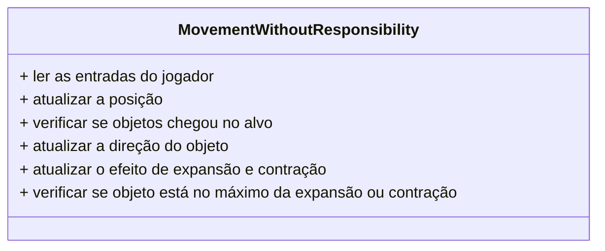
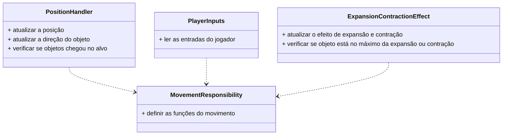

> 💡Nesse artigo você encontrará:
> - Definição do conceito de Responsabilidade Única
> - Um exemplo prático da aplicação do conceito

Quando falamos em boas práticas de programação um dos principais termos que aparecerem em nossas pesquisas são os princípios SOLID. Esses princípios foram criados por Michael Feathers e popularizados por Robert C.Martin, o famoso Uncle Bob, com a finalidade de definir práticas que se seguidas durante o desenvolvimento de software propiciam criar um código mais legível, reutilizável, coeso e assim garantir que o projeto seja futuramente mais fácil de manter e evoluir.

Nesse artigo vamos explorar o primeiro princípio do SOLID, o S de Single Responsibility ou Responsabilidade Única utilizando um exemplo simples.

O princípio da Responsabilidade Única define:

> 📝 "Uma classe deve ter apenas um motivo para mudar."

ou em outras palavras

> 📝 "Um módulo, ou classe, ou método, ou função deve fazer apenas uma única coisa"

As duas definições são válidas e complementares. Pensar em qual motivo uma entidade de software precisa ser alterada pode levar a entender bem qual é sua responsabilidade. Se uma entidade está sendo alterada por vários motivos, provavelmente esta entidade tem muitas responsabilidades.

A ideia é que separando as responsabilidades em pequenos contextos de responsabilidade diminuímos o impacto de uma futura modificação. Ao mesmo tempo quando nomeamos qualquer parte do código com um nome bem descritivo melhoramos a sua legibilidade e deixamos mais claro nossa intensão para outros desenvolvedores que futuramente precisarão de ler esse código.

Para demonstrar esse conceito vamos implementar o seguinte cenário:

- O jogador irá controlar uma seta que se movimentará horizontalmente
- Quando a seta chega em uma das extremidades ela troca de direção
- Durante o movimento a seta irá aumentar e diminuir de tamanho.
- A seta deve sempre está virada para a posição que está se direcionando

A implementação desse sistema leva ao seguinte resultado


Apenas com esse exemplo já conseguimos exemplificar vários conceitos de programação, porém iremos focar no contexto do artigo de Responsabilidade Única.

# Primeira versão 

Para exemplificar o conceito do princípio, primeiramente vamos implementar todas essas funcionalidades em uma única classe chamada `MovementWithoutResponsibility` sem a necessidade de me preocupar com nenhum tipo de separação de responsabilidades. Esse tipo de desenvolvimento é o mais comum que vemos em nossos projetos, então iremos partir dele para a explicação do conceito.

```csharp
public class MovementWithoutResponsibility : MonoBehaviour
{
    // Configuração do movimento
    [SerializeField] Transform start;
    [SerializeField] Transform end;

    // Campos referentes a movimentação
    Vector3 startPosition;
    Vector3 target;
    float interpolation = 0f;
    float movementSpeed = 0.5f;

    // Campos referentes ao efeitos de Expansão/Contração
    Vector3 minSize = new(0.5f, 0.5f, 0.5f);
    Vector3 maxSize = new(1.7f, 1.7f, 1.7f);
    float scaleInterpolation = 0f;
    float scaleSpeed = 1f;

    public void Start()
    {
        // Inicialização do objeto
        startPosition = start.position;
        target = end.position;
        transform.position = startPosition;
    }

    public void Update()
    {
        // Verificação da entrada do jogador
        if(!Keyboard.current.spaceKey.isPressed)
            return;

        // Cálculo da posição
        interpolation += Time.deltaTime * movementSpeed;
        transform.position = Vector3.Lerp(startPosition, target, interpolation);

        // Cálculo da direção
        var direction = (target - startPosition).normalized;
        transform.right = direction;

        // Critério de parada do movimento
        if(Vector3.Distance(transform.position, target) < 0.001f)
        {
            // Atualização do alvo do movimento
            (target, startPosition) = (startPosition, target);
            interpolation = 0f;
        }

        // Cálculo do efeito de Expansão/Contração
        scaleInterpolation += Time.deltaTime * scaleSpeed;
        transform.localScale = Vector3.Lerp(minSize, maxSize, scaleInterpolation);

        // Condição de parada do efeito de Expansão/Contração
        if(scaleInterpolation > 1f)
        {
            // Atualização do efeito de Expansão/Contração
            (minSize, maxSize) = (maxSize, minSize);
            scaleInterpolation = 0f;
        }
    }
}
```

Todas as responsabilidades implementadas pela classe `MovementWithoutResponsibility` estão em comentários no código. Temos por exemplo:

- A forma que o jogador interage com o movimento
- A forma que a posição é calculada
- A forma que o efeito de Expansão e Contração é calculado

Pelo que analisamos essa classe fere severamente o princípio. Caso futuramente precisemos alterar esses pontos levantados, será necessário alterar todo o código, podendo resultar em bugs e comportamentos inesperados.

Vamos partir dessa implementação para isolar todas essas responsabilidades em seus devidos contextos e nossa hipótese é que no final teremos um projeto mais simples de manter e evoluir no futuro.

## Refatoração do cálculo de posição

Para começar a refatoração vamos começar pela função principal, o cálculo da posição do objeto. Para isso vamos juntar as responsabilidades referentes a posição do objeto em uma única classe.

Essa classe será responsável pela manipulação da posição do objetos. Cada método público da classe será responsável por um aspecto da posição.

Os aspectos da posição implementados são

- Atualização da posição de um transform
- Verificar se o objeto chegou na posição final
- Trocar de lado o movimento.

Podemos refatorar a classe original removendo essas 3 responsabilidades para sua própria classe chamada de `PositionHandler`.

```csharp
public class PositionHandler
{
    private readonly Transform transform;
    private readonly float speed;

    private Vector3 startPosition;
    private Vector3 target;
    private float interpolation = 0f;

    public PositionHandler(
        Transform transform,
        Vector3 startPosition,
        Vector3 target,
        float speed
    )
    {
        this.transform = transform;
        this.startPosition = startPosition;
        this.target = target;
        this.speed = speed;
    }

    public void Update(float amount)
    {
        interpolation += amount * speed;
        transform.position = Vector3.Lerp(startPosition, target, interpolation);
    }

    public bool WasTargetReached()
    {
        return Vector3.Distance(transform.position, target) < 0.001f;
    }

    public void ChangeDirection()
    {
        (target, startPosition) = (startPosition, target);
        interpolation = 0f;

        var direction = (target - startPosition).normalized;
        transform.right = direction;
    }
}
```

E então refatoramos a classe original substituindo o código anterior por chamadas a nova classe criada.

```csharp
public class MovementWithResponsibility : MonoBehaviour
{
    // ... código

    private PositionHandler positionHandler;

    public void Start()
    {
        // Inicialização do objeto
        positionHandler = new(transform, start.position, end.position, 0.5f);
    }

    public void Update()
    {
      // ... código

      // Cálculo da posição
      positionHandler.Update(Time.deltaTime);

      if(positionHandler.WasTargetReached())
          positionHandler.ChangeDirection();

      // ... código
    }
}
```

Dessa forma a responsabilidade de manipular a posição do objeto agora está isolada em sua própria estrutura. Por exemplo o método criado `ChangeDirection()`, deixa claro o que está sendo feito em relação a versão anterior que a primeira vista se tratava de uma troca de valores. 

Outra melhoria que percebemos foi a remoção do cálculo da direção do objeto de cada frame. Quando a refatoração da mudança de direção foi feita e então foi criado o método `ChangeDirection()`, ficou mais fácil de perceber a oportunidade de extrair a função de calcular a direção para ser executada apenas quando a direção foi alterada. Essa é uma melhoria muito grande, esse cálculo estava sendo executado a cada frame e agora é executado apenas quando a direção é alterada.

# Refatoração da entrada do Jogador

Para a próxima melhoria vamos refatorar o input do jogador. Separar o input do jogador é sempre interessante, já que esse mesmo input pode ser utilizado em vários pontos do código e não deveria ser fixo para o movimento de um objeto.

```csharp
public class PlayerInputs
{
    public bool IsMovementPressed()
    {
        return Keyboard.current.spaceKey.isPressed;
    }
}
```

```csharp
public class MovementWithResponsibility : MonoBehaviour
{
    public void Update()
    {
        // Verificação da entrada do jogador
        if(!playerInputs.IsMovementPressed())
            return;

        // ... código
    }
}
```

A classe que controla a movimentação do objeto agora não depende de saber que tipo de tecla ou de condição é satisfeita para a classe principal seguir com o código do movimento. Isso nos permite futuramente alterar a tecla pressionada ou adicionar uma condição de tempo de pressão que o movimento irá ser executado da mesma forma.

Além disso criamos mais um contexto de responsabilidade. A classe `PlayerInputs` tem a responsabilidade (função) de resolver as entradas do jogador e apenas isso. Está classe agora tem um nome simples de entender que pode ser facilmente referenciado dentro de todo o projeto.

# Refatoração do efeito de Expansão e Contração

Para finalizar vamos refatorar a última parte, referente ao efeito de expansão e contração que a seta executada. Esse efeito será refatorado de forma muito análoga ao cálculo de posição, porém aqui é interessante entender que mesmo sendo duas operações implementadas de forma muito parecida tem responsabilidades diferentes. 

Como código final de nossa sessão de refatoração temos

```csharp
public class MovementWithResponsibility : MonoBehaviour
{
    // Configuração do movimento
    [SerializeField] Transform start;
    [SerializeField] Transform end;

    private PositionHandler positionHandler;
    private PlayerInputs playerInputs;
    private ExpansionContractionEffect expansionContractionEffect;

    public void Start()
    {
        // Inicialização do objeto
        positionHandler = new(transform, start.position, end.position, 0.5f);
        expansionContractionEffect = new(
            transform, new(0.5f, 0.5f, 0.5f), new(1.7f, 1.7f, 1.7f), 1f
        );
        playerInputs = new PlayerInputs();
    }

    public void Update()
    {
        // Verificação da entrada do jogador
        if(!playerInputs.IsMovementPressed())
            return;

        // Cálculo da posição
        positionHandler.Update(Time.deltaTime);

        if(positionHandler.WasTargetReached())
            positionHandler.ChangeDirection();

        // Cálculo do efeito de Expansão/Contração
        expansionContractionEffect.Update(Time.deltaTime);

        if(expansionContractionEffect.IsOnLimit())
            expansionContractionEffect.ChangeScaleDirection();
    }
}
```

Encapsulamos em seus contextos de responsabilidade cada uma das operações executadas para realizar a movimentação do objeto. Antes tínhamos um contexto de responsabilidade apenas que fazia tudo (🐶 famosa classe Severino), no caso o `MovementWithoutResponsibility` e agora quebramos essa responsabilidade em contextos menores que apresentam apenas uma condição para serem alterados.

Ou seja, se quisermos alterar a forma que posição do objeto é calculada alteramos a classe `PositionHandler`. Se quisermos alterar a forma que o jogador interage com o jogo, alteramos a classe `PlayerInputs`. E por fim se quisermos alterar o efeito de expansão e contração alteramos a classe `ExpansionContractionEffect`.

Afinal temos o mesmo resultado, porém agora com um código muito mais limpo.


## Diagrama da refatoração

Só para deixar mais claro segue um diagrama com o antes.



Depois da refatoração



# Biluca, o que tiramos disso tudo?

O princípio de Responsabilidade Única é uma forma de distribuirmos a responsabilidade pelo código e assim garantir que esses contextos de responsabilidades sejam criados. Utilizar esse princípio exige experiência do desenvolvedor, saber restringir as responsabilidade não é uma tarefa simples, mas com prática pode se virar em uma prática crucial para o desenvolvimento, principalmente para projetos maiores onde o código é reutilizado em vários contextos e de diversas funções.

Como podemos ver com todos esses exemplos de refatorações, implementar apenas o conceito de <mark>Responsabilidade Única não altera muito a estrutura do código.</mark> Podemos combinar esse conceito com vários outros princípios como Modularização, Coesão, Separação de responsabilidades a fim de criarmos estruturas mais dinâmicas e eficientes assim então revolucionarmos a forma que escrevemos código.

Com todos esses conceitos combinados conseguimos criar um código mais limpo e claro para nós desenvolvedores, além de como vimos no caso do cálculo de mudança de direção até mais performático.

# Referências